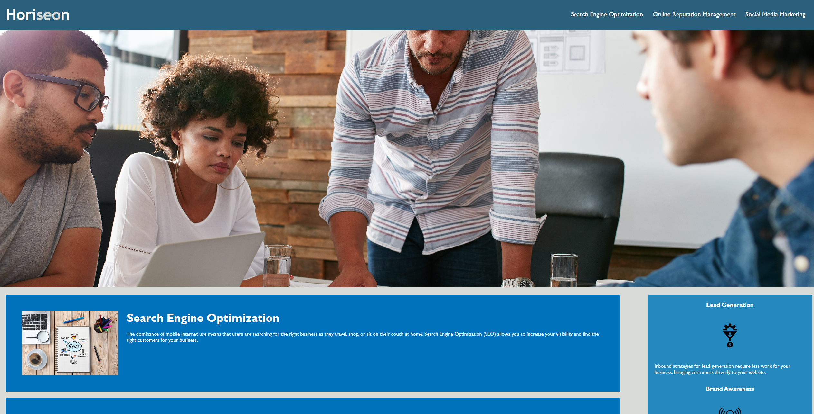

# UCI Module 1 Challenge

## Description

Provide a short description explaining the what, why, and how of your project. Use the following questions as a guide:

- What was your motivation?
- Why did you build this project? (Note: the answer is not "Because it was a homework assignment.")
- What problem does it solve?
- What did you learn?

This is a website for a marketing agency to educate users on the importance of Search Engine Optimization (SEO). The codebase of the site has been altered to reflect the importance of this by changing non-semantic elements in the code to semantic elements. 

## Table of Contents (Optional)

If your README is long, add a table of contents to make it easy for users to find what they need.

- [UCI Module 1 Challenge](#uci-module-1-challenge)
  - [Description](#description)
  - [Table of Contents (Optional)](#table-of-contents-optional)
  - [Installation](#installation)
  - [Usage](#usage)
  - [Credits](#credits)
  - [License](#license)
  - [Badges](#badges)
  - [Features](#features)
  - [How to Contribute](#how-to-contribute)
  - [Tests](#tests)

## Installation

What are the steps required to install your project? Provide a step-by-step description of how to get the development environment running.

To install and run this project locally, download the associated files from the repository to a single folder. From there, run the index.html file in your preferred web browser where you can view the webpage's code in the DevTools(Right Click>Inspect/Ctrl+Shift+C).

Otherwise the deployed version of the webpage can be accessed through the following link [link]


## Usage
In order to use this website, open the webpage in your browser to launch the homepage. To confirm non-semantic elements were replaced with semantic elements, you can open the browser's DevTools/Inspector--CTRL+Shift+I for Windows, CMD+Option+I for Mac--which will open a console panel on the side of your screen displaying the site's code. 

Use the Navbar at the top of the screen to quickly move between topics on the page and learn about the importance of Search Engine Optimization.

  

Provide instructions and examples for use. Include screenshots as needed.

To add a screenshot, create an `assets/images` folder in your repository and upload your screenshot to it. Then, using the relative filepath, add it to your README using the following syntax:

    ```md
    
    ```

## Credits

List your collaborators, if any, with links to their GitHub profiles.

If you used any third-party assets that require attribution, list the creators with links to their primary web presence in this section.

If you followed tutorials, include links to those here as well.

## License

The last section of a high-quality README file is the license. This lets other developers know what they can and cannot do with your project. If you need help choosing a license, refer to [https://choosealicense.com/](https://choosealicense.com/).

---

🏆 The previous sections are the bare minimum, and your project will ultimately determine the content of this document. You might also want to consider adding the following sections.

## Badges


Badges aren't necessary, per se, but they demonstrate street cred. Badges let other developers know that you know what you're doing. Check out the badges hosted by [shields.io](https://shields.io/). You may not understand what they all represent now, but you will in time.

## Features

If your project has a lot of features, list them here.

## How to Contribute

If you created an application or package and would like other developers to contribute it, you can include guidelines for how to do so. The [Contributor Covenant](https://www.contributor-covenant.org/) is an industry standard, but you can always write your own if you'd prefer.

## Tests

Go the extra mile and write tests for your application. Then provide examples on how to run them here.